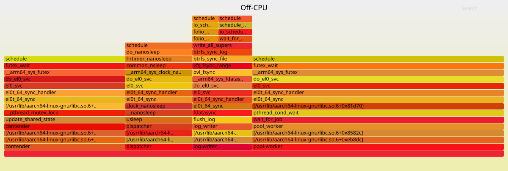

# Example exercising the offcpu module

A small C program whose threads block for different reasons, so each kind
of blocking shows up as its own stack:

| Thread (`comm`) | Count | What it does | How it blocks |
|---|---|---|---|
| `pool-worker` | 4 | waits for jobs, runs each for 1ms | `pthread_cond_wait` - idle most of the time |
| `dispatcher` | 1 | queues one job every 200ms | `usleep` |
| `contender` | 3 | takes a shared mutex and holds it for 2ms, then 0.5ms outside | `pthread_mutex_lock` - the lock is busy almost all the time |
| `log-writer` | 1 | writes 64KB to a file and `fdatasync`s it, in a loop | disk I/O |

Each thread is named with `pthread_setname_np`, so `comm` already tells
them apart; the stacks show *where* each one blocks.

It's built so stacks can be walked all the way: compiled with
`-fno-omit-frame-pointer -mno-omit-leaf-frame-pointer`, not stripped, and
running on Ubuntu 24.04, whose glibc is built with frame pointers too. On
an image whose libc lacks them (most other distros), user stacks stop
inside libc.

## Run it

```
docker build -t blocking-mix .
docker run -d --name blocking-mix blocking-mix
```

## Get its container ID

```
docker inspect -f '{{.Id}}' blocking-mix
```

A short prefix (e.g. the first 12 characters) is normally enough.

## Run offcpu against it

From the repo root (assuming `make docker-build` was run before):
```
sudo make docker-run ARGS="offcpu -container <id> -interval 5s -top 0"
```

The raw events are long single-line JSON objects. To read one, this
prints each stack as its user and kernel frames, leaf first:
```
jq -r '.Data | "total_us=\(.total_us) num_stacks=\(.num_stacks)", (.stacks[] | "\(.comm)\t\(.state)\tcount=\(.count)\t\(.total_us)us\n    U: \(.user_stack | join(" < "))\n    K: \(.kernel_stack | join(" < "))")'
```

One 5s interval, through that filter (on an arm64 OrbStack VM; libc
frames shortened to `libc+0x...`):

```
total_us=38487331 num_stacks=7
pool-worker	S	count=25	20092802us
    U: [libc+0x81d70] < pthread_cond_wait < wait_for_job < pool_worker < [libc+0x8582c] < [libc+0xeb8dc]
    K: schedule < futex_wait < __arm64_sys_futex < do_el0_svc < el0_svc < el0t_64_sync_handler < el0t_64_sync
contender	S	count=2456	8832909us
    U: [libc+0x82040] < __pthread_mutex_lock < update_shared_state < contender < [libc+0x8582c] < [libc+0xeb8dc]
    K: schedule < futex_wait < __arm64_sys_futex < do_el0_svc < el0_svc < el0t_64_sync_handler < el0t_64_sync
dispatcher	S	count=25	5027772us
    U: clock_nanosleep < __nanosleep < usleep < dispatcher < [libc+0x8582c] < [libc+0xeb8dc]
    K: schedule < do_nanosleep < hrtimer_nanosleep < common_nsleep < __arm64_sys_clock_nanosleep < do_el0_svc < el0_svc < el0t_64_sync_handler < el0t_64_sync
log-writer	D	count=6257	3074496us
    U: fdatasync < flush_log < log_writer < [libc+0x8582c] < [libc+0xeb8dc]
    K: schedule < schedule_timeout < io_schedule_timeout < wait_for_completion_io < write_all_supers < btrfs_sync_log < btrfs_sync_file < vfs_fsync_range < ovl_fsync < __arm64_sys_fdatasync < do_el0_svc < el0_svc < el0t_64_sync_handler < el0t_64_sync
log-writer	D	count=6256	1459259us
    U: fdatasync < flush_log < log_writer < [libc+0x8582c] < [libc+0xeb8dc]
    K: schedule < io_schedule < folio_wait_bit_common < folio_wait_bit < write_all_supers < btrfs_sync_log < btrfs_sync_file < vfs_fsync_range < ovl_fsync < __arm64_sys_fdatasync < do_el0_svc < el0_svc < el0t_64_sync_handler < el0t_64_sync
pool-worker	S	count=1	70us
    U: [libc+0x82040] < [libc+0x87d00] < pthread_cond_wait < wait_for_job < pool_worker < [libc+0x8582c] < [libc+0xeb8dc]
    K: schedule < futex_wait < __arm64_sys_futex < do_el0_svc < el0_svc < el0t_64_sync_handler < el0t_64_sync
contender	D	count=1	20us
    U: spin < update_shared_state < contender < [libc+0x8582c] < [libc+0xeb8dc]
    K: schedule < io_schedule < bit_wait_io < __wait_on_bit < out_of_line_wait_on_bit < read_extent_buffer_pages < btrfs_read_extent_buffer < btrfs_search_slot < btrfs_lookup_file_extent < btrfs_get_extent < btrfs_do_readpage < btrfs_readahead < page_cache_ra_unbounded < page_cache_ra_order < filemap_fault < handle_mm_fault < do_mem_abort < el0_ia < el0t_64_sync_handler < el0t_64_sync
```

What to notice:

- **The biggest total isn't the problem.** The four idle pool workers
  account for 20s of the 38s - each was off-CPU for nearly the whole
  interval, which is exactly what an idle pool should do. Off-CPU time
  measures waiting, not badness; most services are dominated by threads
  waiting for work like this.
- **Idle and contention look identical to the kernel.** Pool workers and
  contenders are both in state `S`, with the same kernel stack
  (`futex_wait`) - a condition variable and a contended mutex are both a
  futex underneath. Only the user stacks tell them apart:
  `pthread_cond_wait < wait_for_job` versus
  `__pthread_mutex_lock < update_shared_state`. That's what stacks add over
  per-thread totals.
- **The shape differs too.** 25 waits averaging ~800ms (idle) versus 2456
  waits averaging ~3.6ms (contention). Many short waits on a lock is the
  signature of contention: here each contender spends ~60% of its time
  waiting to get in.
- **Disk I/O is `D`**, with the whole storage path in the kernel stack:
  `fdatasync` on the container's root filesystem goes through overlayfs
  (`ovl_fsync`) to the host's filesystem - btrfs, in OrbStack's VM - and
  waits for the device to complete the write. The two `log-writer` stacks
  are two different waits inside the same sync. On another host this part
  looks different (e.g. ext4 and `jbd2`), and the fsync count and timing
  depend on the disk.
- **The timer sleep is the simplest stack**: 25 sleeps of 200ms, 5s total
  - the dispatcher is off-CPU for the whole interval, as designed.
- **Page faults block too.** The single `contender D` stack is a thread
  touching a page of its own code that wasn't in memory yet
  (`filemap_fault`), and waiting for it to be read from disk. It typically
  shows up once, early on; it's not something the program does on
  purpose, but it's a real source of off-CPU time - memory-mapped files,
  and binaries after being paged out, hit the same path.

`[libc+0x...]` frames are glibc functions that aren't exported:
Ubuntu ships libc without its full symbol table (only `.dynsym`), and the
module doesn't look for separate debug symbols. The two at the root of
every stack are where every thread starts, so they're presumably glibc's
thread start-up code (`start_thread` and the `clone` entry point).


## As a flame graph

The `folded` field of each stack is in the format flame graph tools take.
To get one interval into that format:

1. Run the module as usual, with `-top 0` so every stack is included:
   ```
   sudo make docker-run ARGS="offcpu -container <id> -interval 10s -top 0"
   ```
2. Once an interval has been printed, copy one whole event line (it starts
   with `{"Module":"offcpu"`) and save it as `event.json`.
3. Turn it into folded stacks, one per line, weighted by off-CPU time:
   ```
   jq -r '.Data.stacks[] | "\(.folded) \(.total_us)"' event.json > offcpu.folded
   ```

`offcpu.folded` can be dropped into [speedscope](https://www.speedscope.app)
or rendered with Brendan Gregg's `flamegraph.pl`:
```
flamegraph.pl --countname=us --title="Off-CPU" offcpu.folded > offcpu.svg
```

For one 10s interval of this workload:



Each box is a function, sitting on top of the function that called it: the
thread name (`comm`) at the bottom, then user frames, then kernel frames up
to `schedule`, where the thread left the CPU. A box's width is the
off-CPU time of all the stacks passing through it - here 73s in total,
since nine threads were each off-CPU for part of the 10s. Left-to-right
order is alphabetical, not time. The colors don't mean anything; they just
separate neighboring boxes. (Brendan Gregg's off-CPU flame graphs use
`--colors=io` for a blue palette, to tell them apart from CPU profiles at a
glance.)

Reading it bottom-up gives the same picture as the stack listing above, at
a glance:

- `pool-worker` → `wait_for_job` → `pthread_cond_wait` is half the graph
  (50%): idle threads waiting for work.
- `contender` → `update_shared_state` → `__pthread_mutex_lock` is 24%: the
  lock contention.
- `dispatcher` → `usleep` is 13%, and `log-writer` → `flush_log` →
  `fdatasync`, down through `ovl_fsync` and btrfs, is 12%.

The towers of contention and idle waiting end in the same kernel frames
(`__arm64_sys_futex` → `futex_wait` → `schedule`); they only split apart
in user space. And a flame graph only shows totals: the contenders' 24%
is thousands of waits of a few milliseconds, the pool's 50% around fifty
long ones (one per job), and that difference is only in the event's
`count`s.

The SVG is interactive when opened directly in a browser (click a box to
zoom in, Ctrl+F to search, hover for exact times); embedded in a README
it's a static image.

## Cleanup

```
docker rm -f blocking-mix
```
